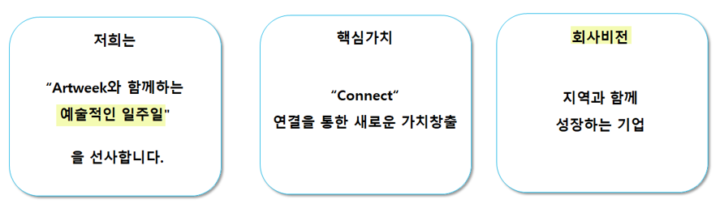
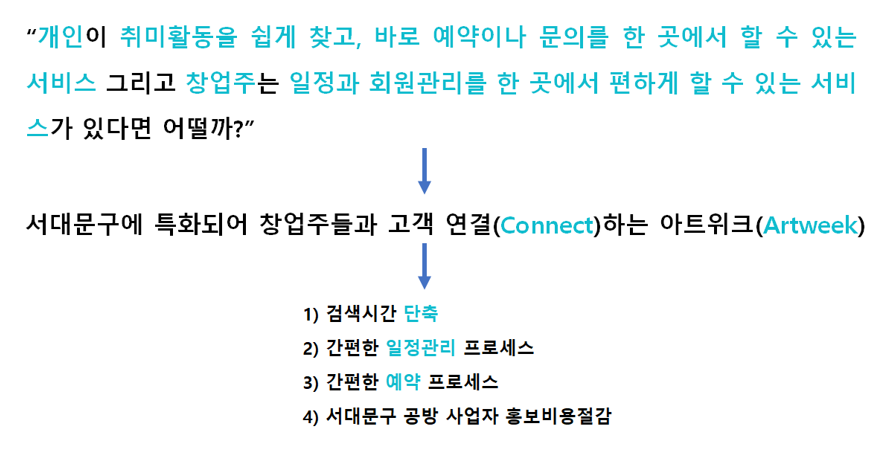
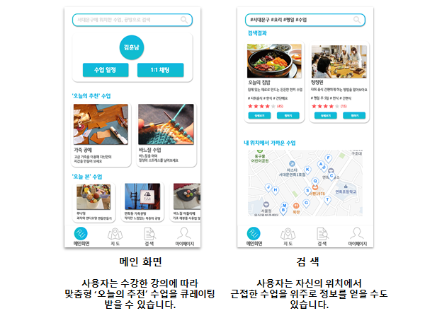
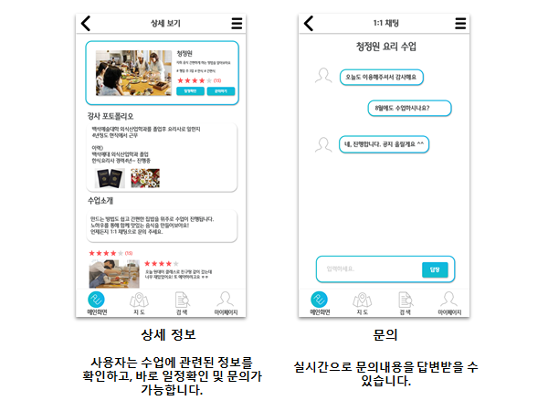
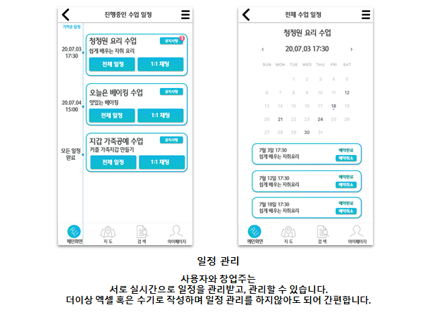
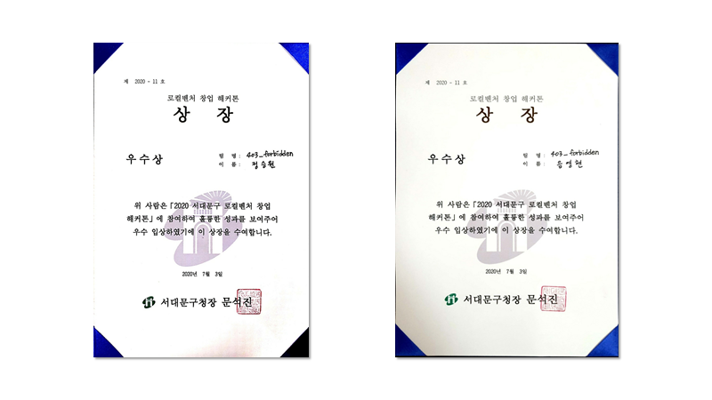

# Sdm-Local-Venture-Hackathon

서대문구 지역활성화를 위한 취미생활 연결 플랫폼, 아트위크입니다.

## 아트위크란?

## 403_forbidden팀 구성

[정승원(대표)](https://github.com/tesschung)

[음영현(공동대표)](https://github.com/EumYoungHyun)

## 부록

해당 해커톤에서 1천만 원 사업비를 지원받았습니다.